# Simplex Internal Portal - Complete Workflow Diagram

## System Overview Workflow

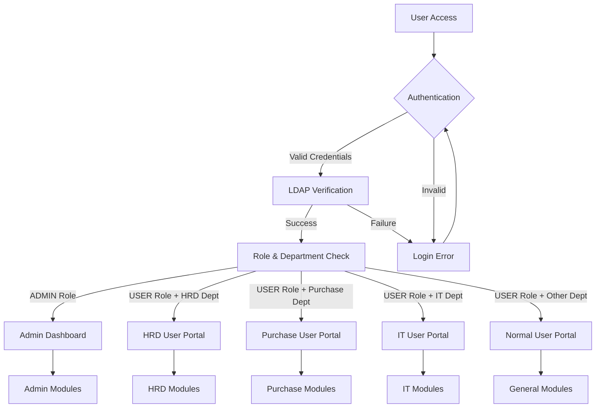

## Authentication Flow

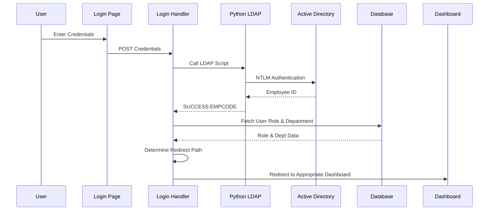

## Admin Dashboard Workflow

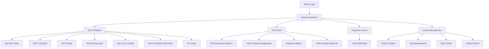

## Employee Registration Workflow

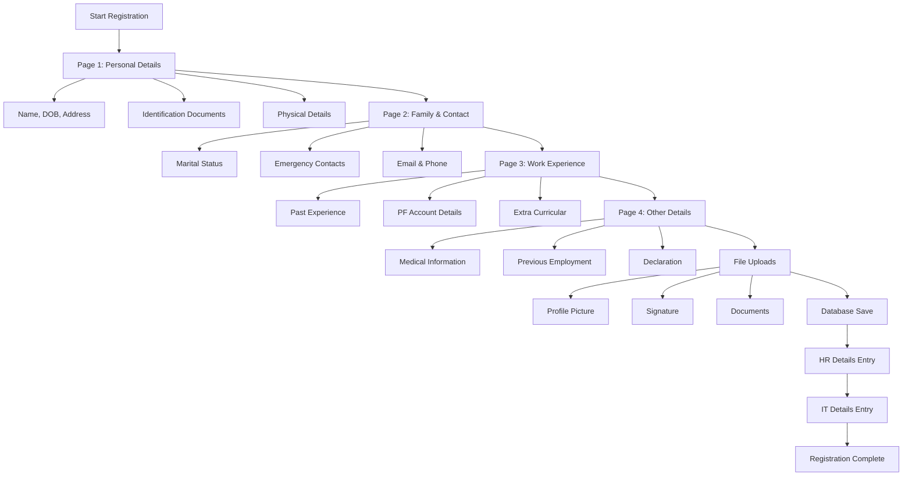

## HR Analytics Workflow

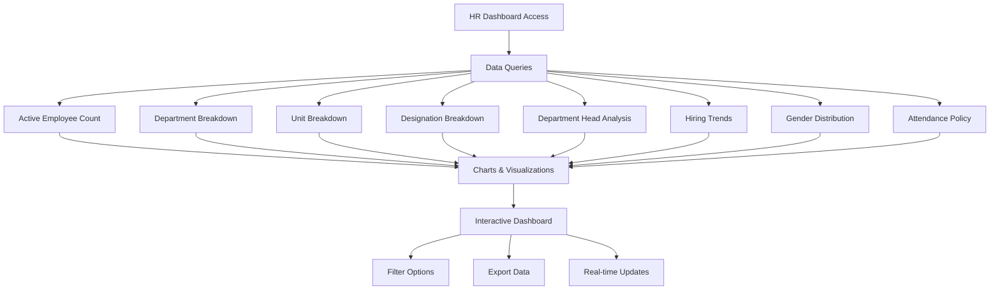

## PO Issues Management Workflow

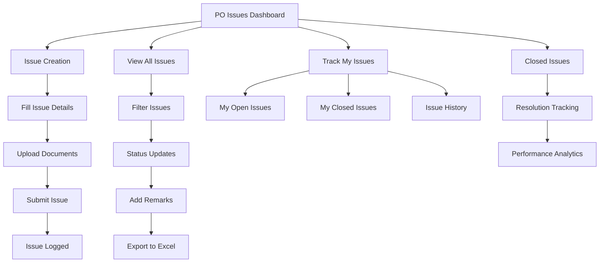

## SAP Integration Workflow

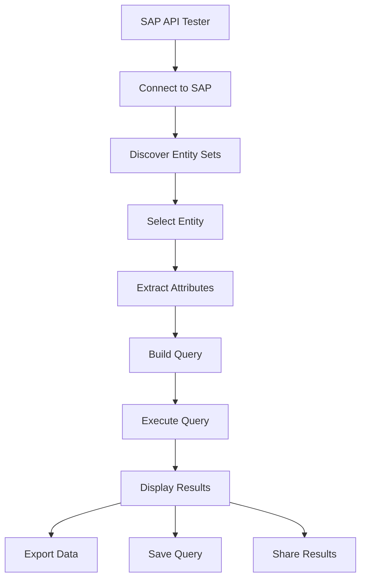

## Project Management Workflow

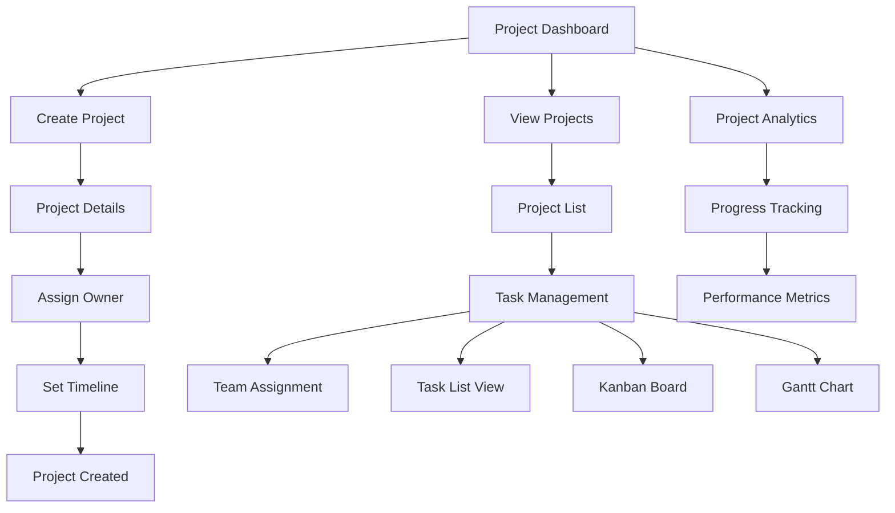

## Learning Management Workflow

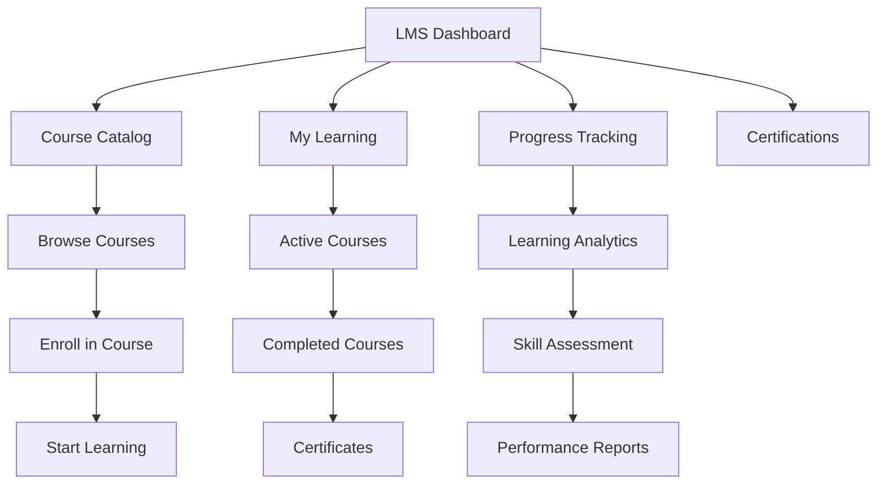

## Data Flow Architecture

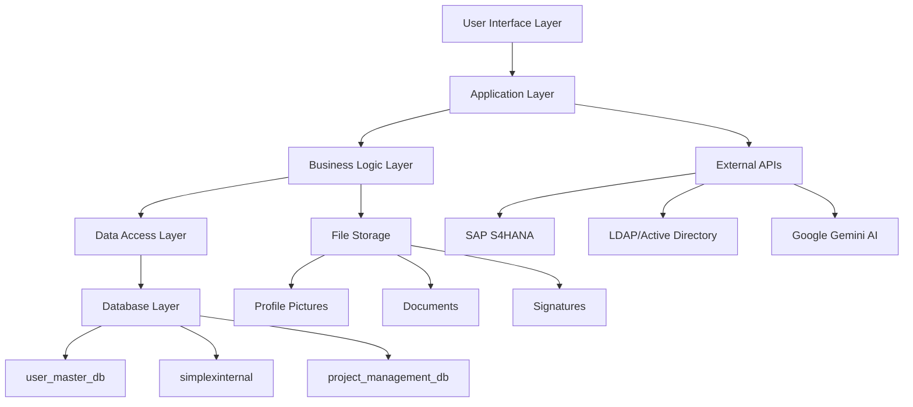

## Security Workflow

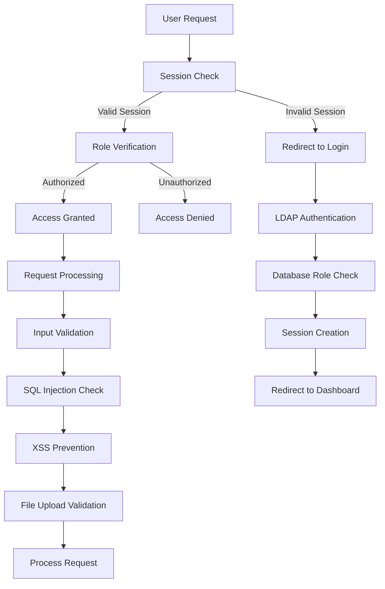

## Error Handling Workflow

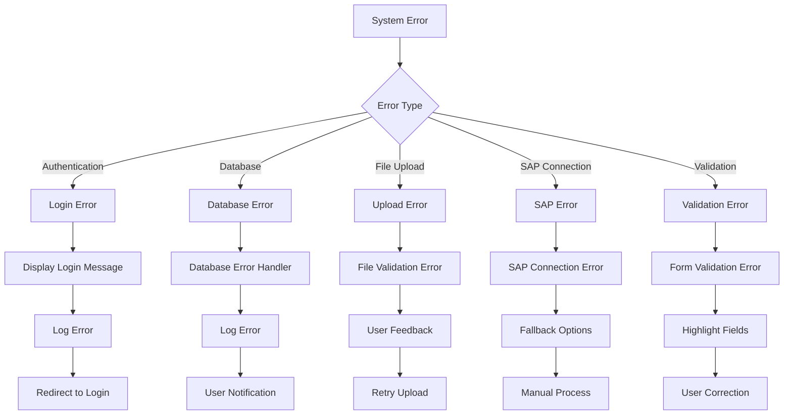

## Database Relationships

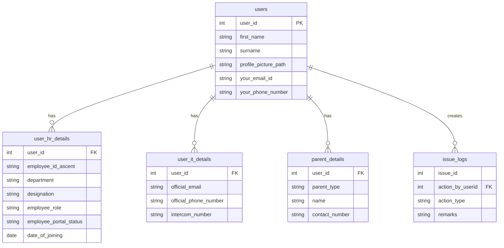

## System Integration Points

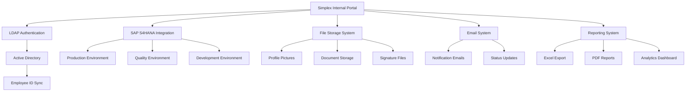

## User Journey Map

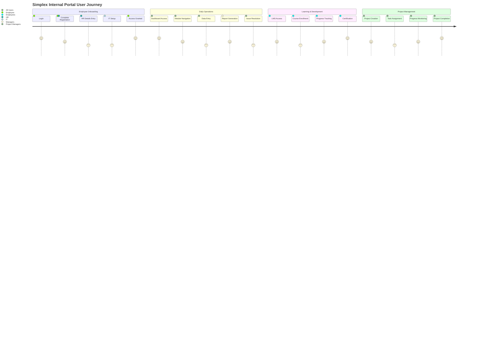

This comprehensive workflow diagram shows the complete system architecture, user flows, data relationships, and integration points of the Simplex Internal Portal. The system provides a robust, secure, and user-friendly platform for enterprise management with role-based access control and comprehensive business process automation. 